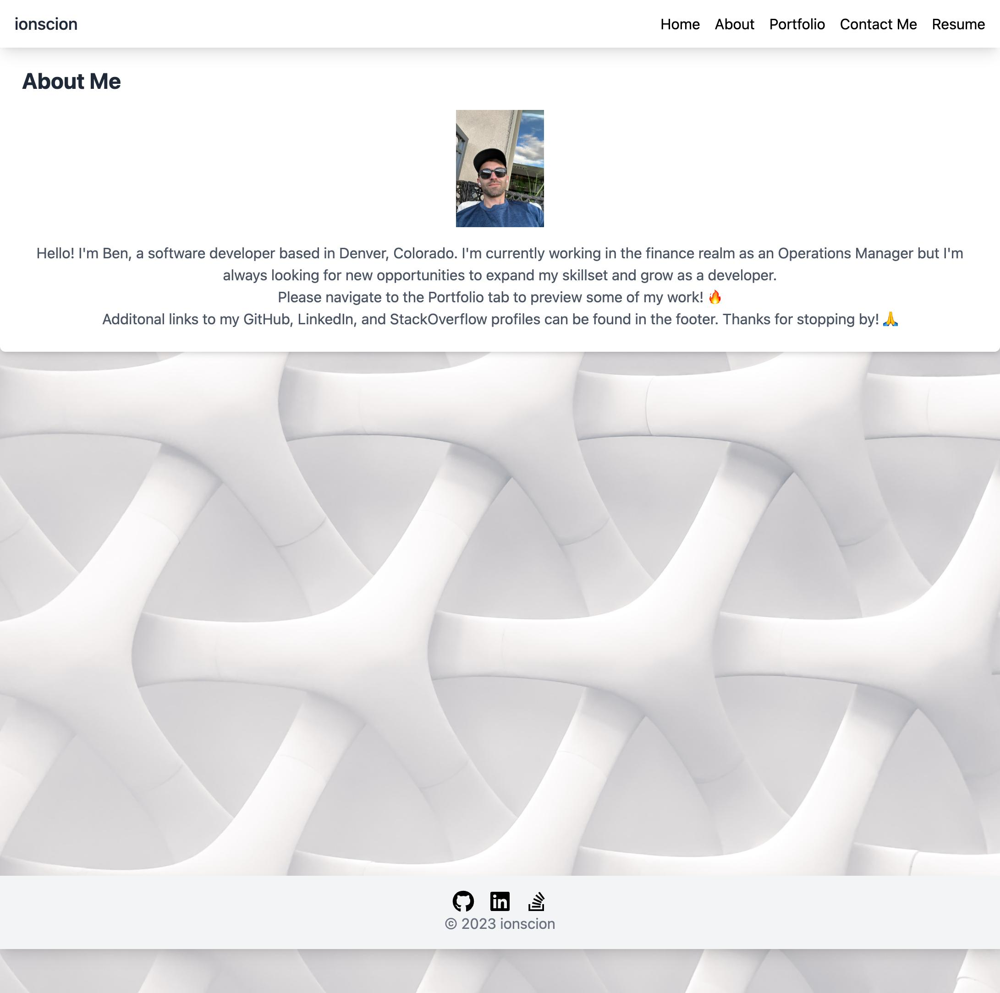

# 20 React Portfolio

## Description
This is a portfolio created using React. It has a header, footer, and a navigation bar. The navigation bar allows the user to navigate to the About Me, Portfolio, Contact, and Resume sections. The Portfolio section contains a Project component that is used multiple times. The application is deployed to Netlify.

## Table of Contents
* [Installation](#installation)
* [Usage](#usage)
* [License](#license)
* [Review](#review)
* [Questions](#questions)
* [Screenshot](#screenshot)
* [Link to Deployed Application](#link-to-deployed-application)
* [Development Notes](#development-notes)

## Installation
To install the necessary dependencies to run locally, run the following command:
- npm i
- npm start

## Development Notes
- I have the application start at the Home route because I'm eventually going to be adding a Home component to display a blog post.
- Additionally, this app was deployed on Netlify as it has a much better interface than Github pages for React deployments.

## Usage
This application is used to display my portfolio.

## License
This project is licensed under the MIT license.

## Questions
If you have any questions about the repo, open an issue or contact me directly at [github.com/ionscion](link)

## Link to Deployed Application
https://main--dynamic-jalebi-584ef6.netlify.app/

## Screenshot
